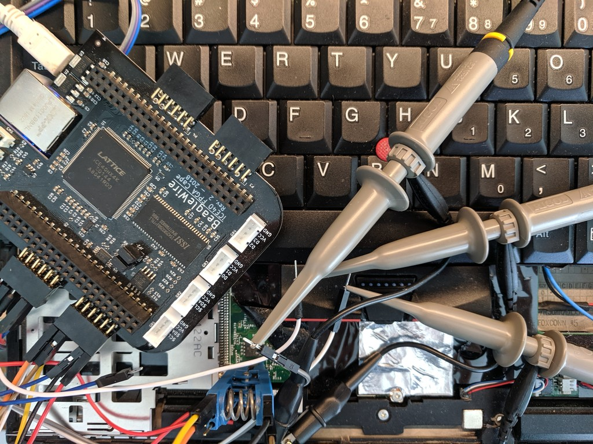
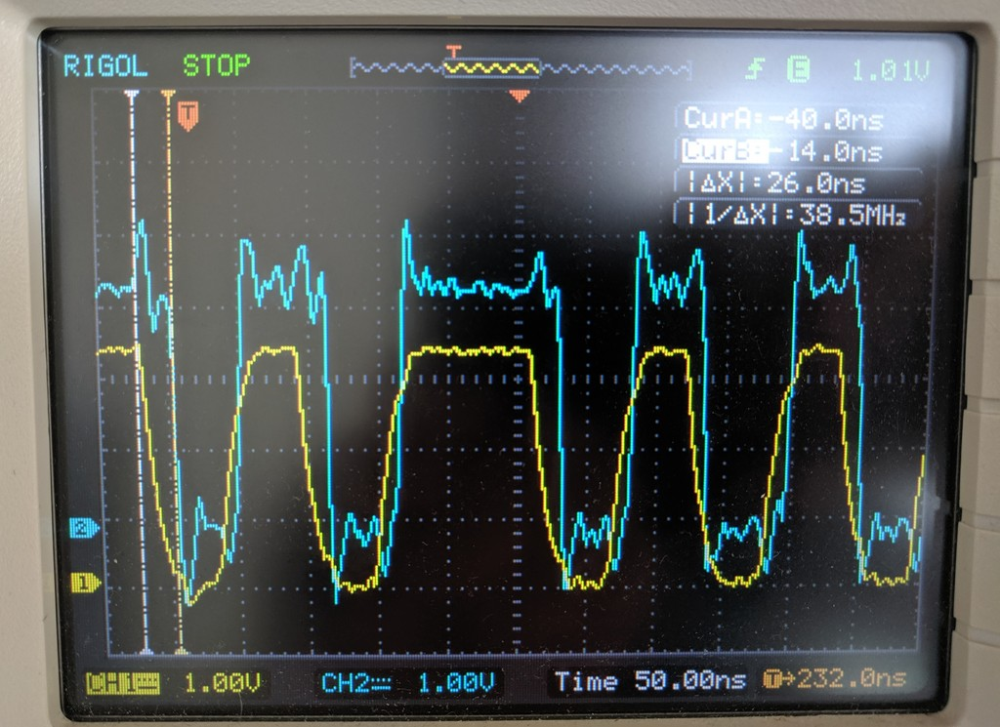
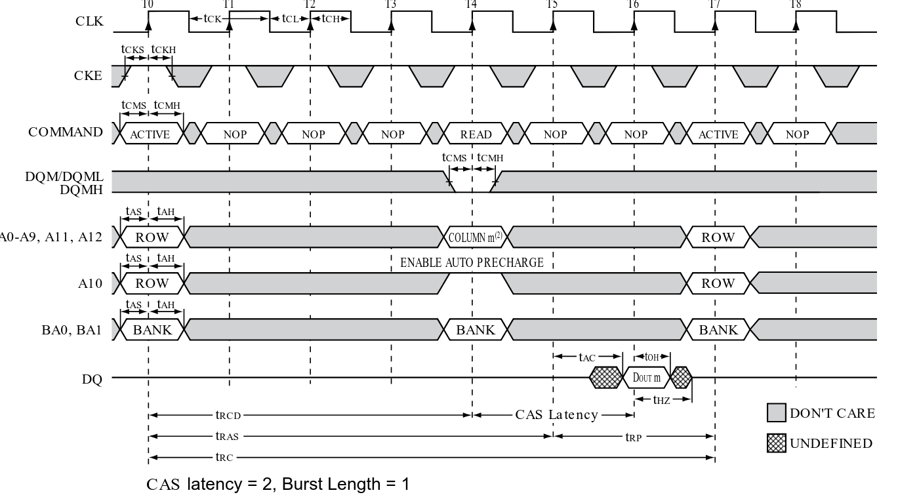

# SPI Spy: Flash emulation

The SPI Spy tool is an open source (both hardware and software)
SPI flash emulation tool.  It an store a flash image in the SDRAM
connected to the FPGA and serve the image to a host CPU over the
SPI bus.

## Platform
The design is currently based on the BeagleWire, which has an
iCE40hx8k FPGA and a 32 MB SDRAM.  The BeagleBone Black is used
as an FPGA programmer, but a separate serial adapter is needed.

## Supported features
* Single SPI up to 20 MHz clock
* 3-byte addressing (up to 16 MB of flash image)
* Logging flash access patterns
* TOCTOU changes to the flash image based on read patterns

## Not yet supported
* Multiple `!CS` pins
* Dual- and Quad-SPI
* Fast read command
* Erase/Write emulation
* Status registers
* Block protection bits
* BeagleBone Black integration
  * Serial port for console
  * Higher bandwidth programming over GPMC
  * A decent API for TOCTOU

# Wiring

Typical 8-SOIC and 8-DIP flash chips:

```
            +------+
    !CE  ---| o    |----  +V
     SO  ---|      |---- !RST
    !WP  ---|      |----  SCK
    GND  ---|      |----  SI
            +------+
```

# Protocol


The SPI protocl is difficult to emulate without specialized hardware
since it has very demanding timing requirements.  The flash device
has no control over the clock and must be able to respond to a random
read request on the very next clock.  At 20 MHz, the slowest SPI bus
on some Intel PCH chipsets, this is 50ns from receiving the last bit of
the address to having to supply the first bit of the data.

Unfortunately, most microcontroller CPUs aren't able to respond to an
incoming SPI byte on the next SPI cycle due to internal muxes and buses,
so they aren't able to reply in time.  Even if the CPU could do it,
most DRAM memory has a 100ns or longer latency for a random read, so
it won't be able to answer quickly enough.  Additionally, DRAM requires
a refresh cycle that takes it offline during the refresh, which adds a
random latency.



These difficulties can be overcome with an FPGA using a custom DRAM
controller.  The FPGA is able to inhibit refresh cycles during the SPI
critical sections, which reduces the latency jitter, and it can split
the DRAM access into two parts: the "row activation" once 16 of the
24 address bits are known, and then "column read" once the last 8 bits
are known.

The row activation command requires at least four DRAM clock cycles,
but can be stretched arbitrarily long with a special control signal wired
into the FPGA's sdram controller from the SPI bus interface.  This allows
the FPGA to overlap the activation with the reception of the last bits,
and the final column read requires only two clock cycles when the DRAM
is configured with a CAS latency of two.

Combined with a direct wiring of the incoming SDRAM data pins to
the output register for the SPI `DO` pin means that a 100 MHz FPGA
can deliver that first bit in two clock cycles after the rising
edge of SPI `CLK` is detected (delayed by at least one clock for
metastability). In practice it appears that the FPGA can have the
bit available with around 5-10 ns to spare before the rising edge
of SPI `CLK`.

Subsequent bytes are "easy" at 20 MHz for single SPI since the
full SDRAM read cycle (7 clocks) fits into the 8 clocks of the
SPI bus. For dual or quad-SPI it will be necessary to configure
a burst mode on the SDRAM controller or allow new column
addresses to be provided dynamically.
